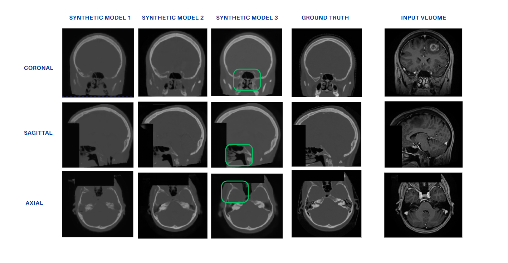

# 🧠 Volumetric MRI-to-CT Brain Synthesis

This project provides a deep learning framework for volumetric (3D) paired MRI-to-CT image synthesis for brain images. It leverages fully volumetric GAN training,validation and test.

> ⚠️ This project is under active development. To access full code or collaboration , please contact the author , mehrankhodadadzadeh90@gmail.com
  ## 🖼️ Example Output

---

## ✅ What This Framework Does

- Translates MRI brain volumes to synthetic CT.
- Utilizes patch-wise GAN training for memory-efficient learning.
- Evaluates voxel-level fidelity using MAE, PSNR, and SSIM inside anatomical masks.
- Supports both simple training and k-fold cross-validation modes.

---

## 📁 Dataset Format

Each patient folder should contain:

dataset_root/
├── patient001/
│ ├── mr.nii.gz # input MRI
│ ├── ct.nii.gz # ground-truth CT
│ └── mask.nii.gz # evaluation mask

To train the model:

python main.py

📦 Requirements
You can install dependencies via:

pip install -r requirements.txt

Or manually:

torch==2.1.2
monai
nibabel
scikit-image
scikit-learn
wandb
tqdm
numpy
